# REmojiTree
This is an R script that builds a phylogenetic tree of emojis.

It is inspired from [PlantPhylomoji](https://github.com/ghuertaramos/PlantPhylomoji). As many recently added emojis are missing from the emojifont package used by PlantPhylomoji, it does not allow to build trees with emojis that were added later than 2016.
To resolve this, REmojiTree downloads images of the emojis from https://emojipedia.org/ to build the tree. 

## Usage
The [ggplot2](https://ggplot2.tidyverse.org/) and [ggtree](https://bioconductor.org/packages/release/bioc/html/ggtree.html) packages are required.
You will need to define the folder you want to download the images to in the imgdir variable.
REmojiTree supports Apple, Twitter, Facebook, Google, Whatsapp and Samsung type emojis. You will need to define the type you want in the emoji_type variable.
REmojiTree can build trees of plant emojis, animal emojis, and the whole emoji tree of life. You will need to define which you want.
After this, you can run the script and the tree will be saved as a .png in the folder you defined.

## Tree examples
These are examples of trees that can be built with REmojiTree:

  
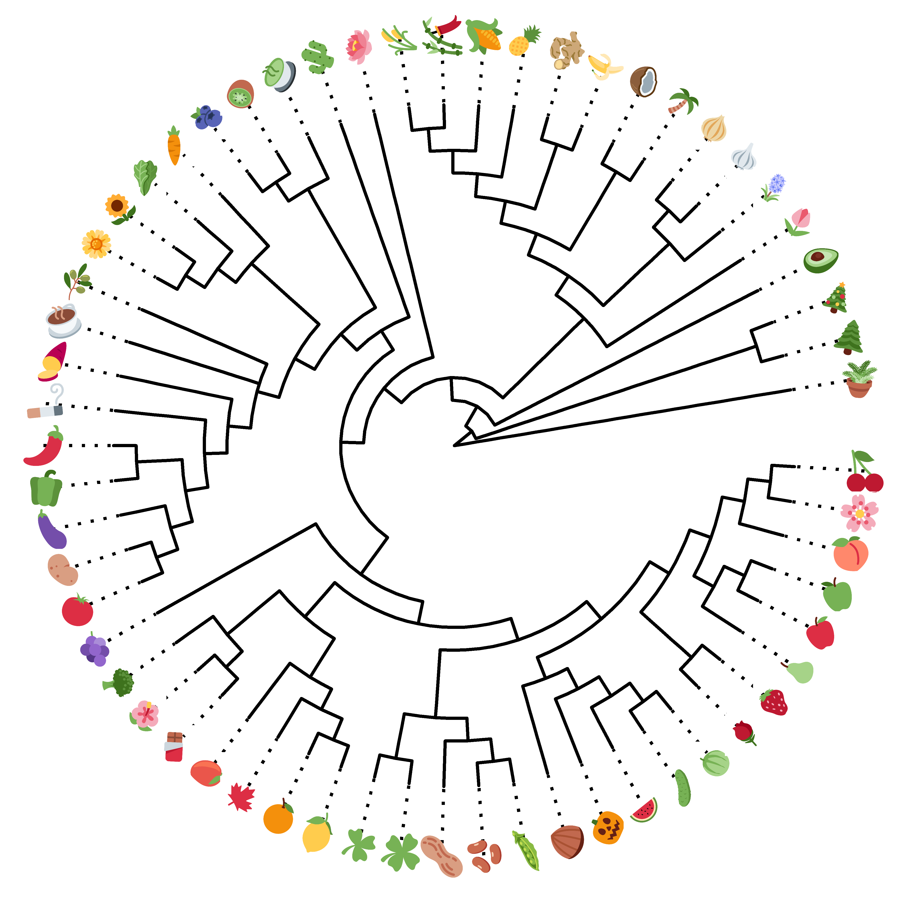

  
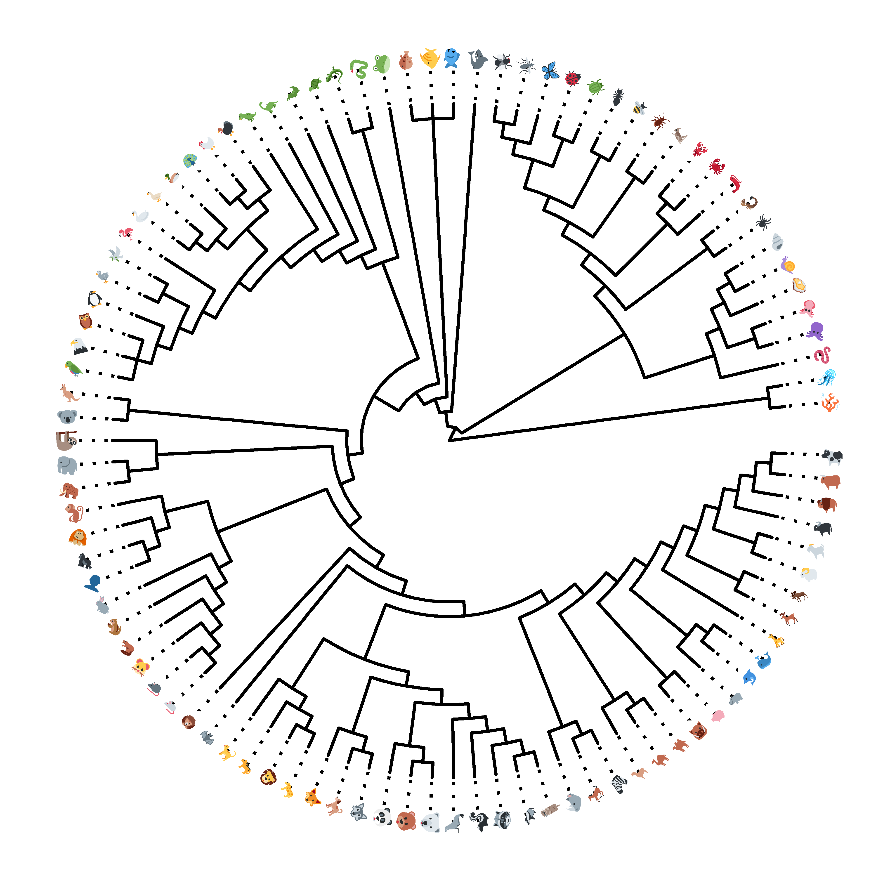

  

## Tables of plant emojis

Some emojis represent different plants depending on the emoji type so the trees will differ. Some choices may be arbitrary. 
Here are the corresponding taxa:

| Emoji | Taxon        | Apple | Facebook | Google | Samsung | Twitter | WhatsApp |
|-------|--------------|--------|---------|---------|----------|---------|----------|
| 🥬   | *Brassica rapa*| 

 | 
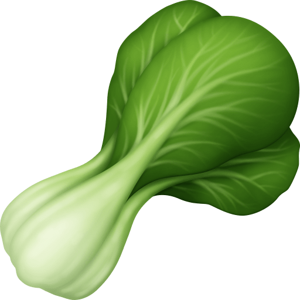
 | 
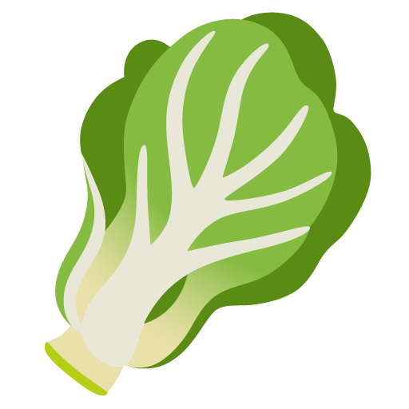
 | 
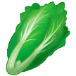
 | | |
| 🥬   | *Lactuca sativa*  | | | | | 
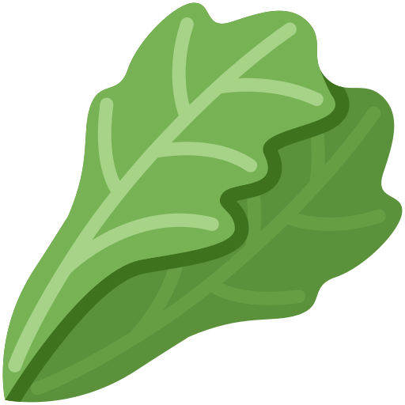
 | 
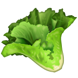
 |
| 🪴   | Filicophyta | | | 
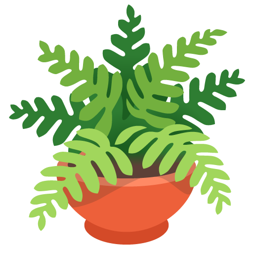
 | | 
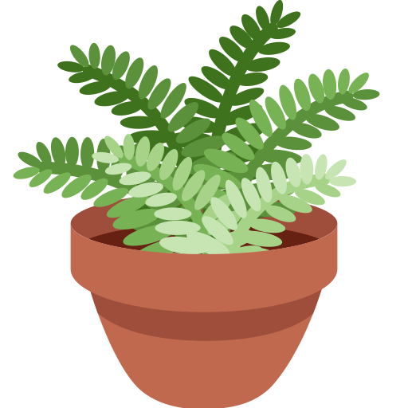
 | |
| 🪴   | Araceae |  | 
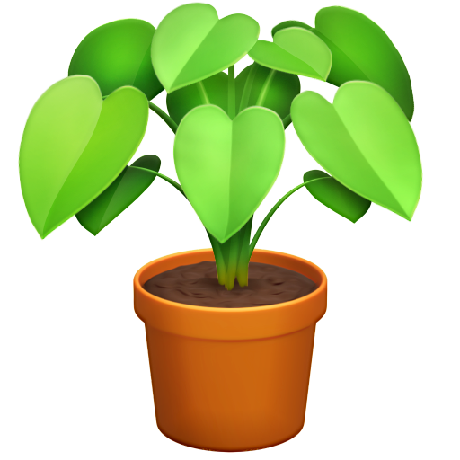
 |  | 
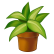
 | | 

 |

Note: the Apple emoji for the potted plant is too generic and no taxon could be clearly attributed.

Here are the corresponding taxa for the remaining plant emojis:

| Emoji | Taxon        | Apple | Facebook | Google | Samsung | Twitter | WhatsApp |
|-------|--------------|--------|---------|---------|----------|---------|----------|
| 🌲   | Gymnospermae | 

 | 
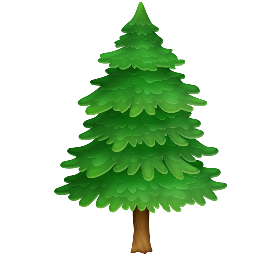
 | 
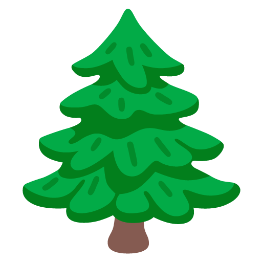
| 
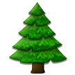
 | 

 | 
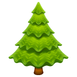
 |
| 🎄   |  Gymnospermae | 

 | 

 | 

| 

 | 

 | 

 |
| 🥑   | *Persea americana* | 
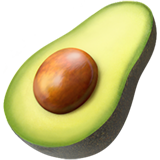
 | 
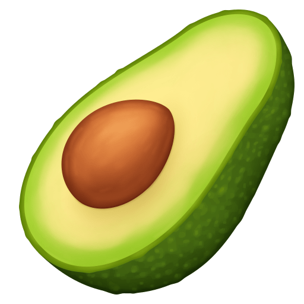
 | 
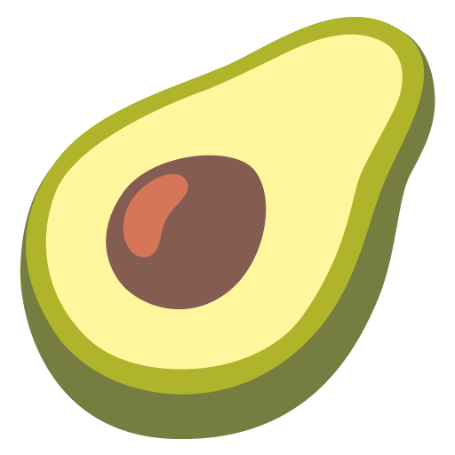
| 
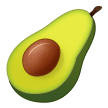
 | 

 | 

 |
| 🪷   | *Nelumbo* spp.| 

 | 

 | 

| 

 | 

 | 

 |
| 🌷   | *Tulipa* spp.| 

 | 

 | 

| 

 | 

 | 

 |
| 🪻   | *Hyacinthus * spp. |  
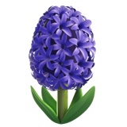
 | 

 | 
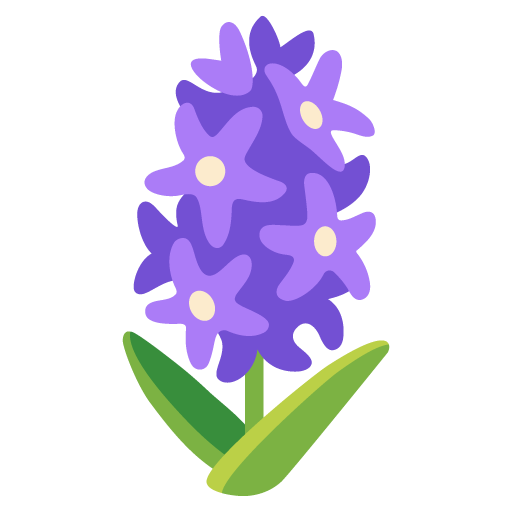
| 
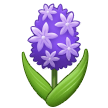
 | 
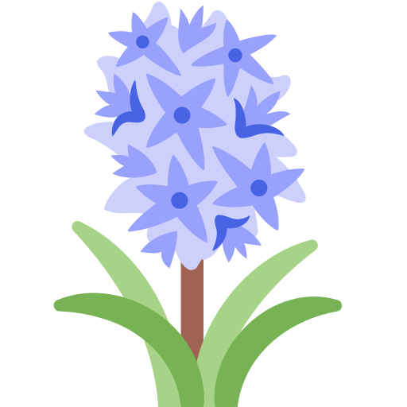
 | 
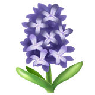
 |
| 🧄   | *Allium sativum* | 
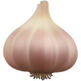
 | 
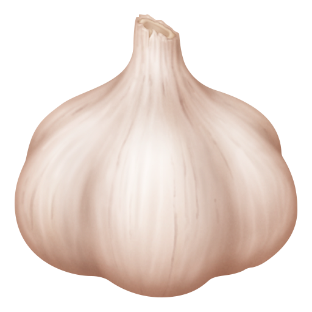
 | 
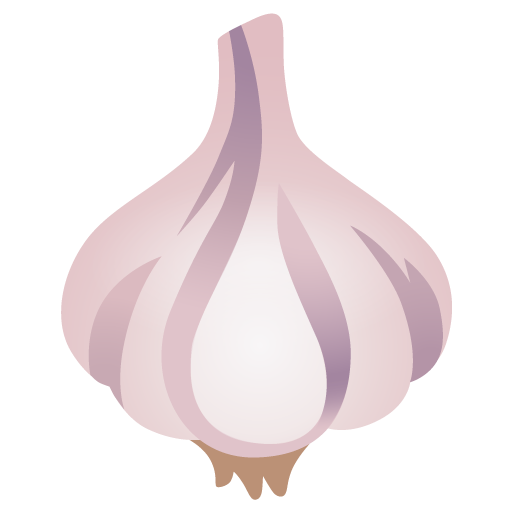
| 
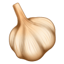
 | 
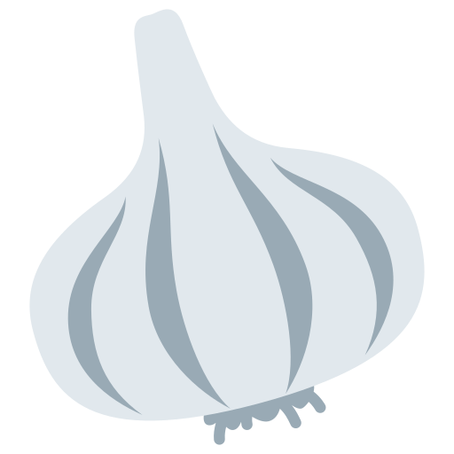
 | 
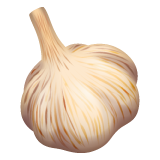
 |
| 🧅   | *Allium cepa* | 
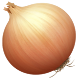
 | 
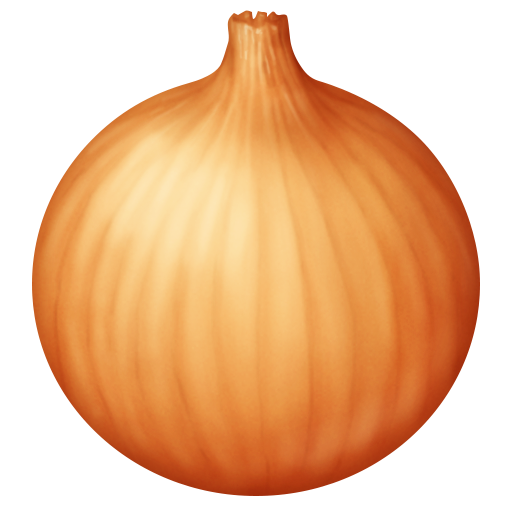
 | 
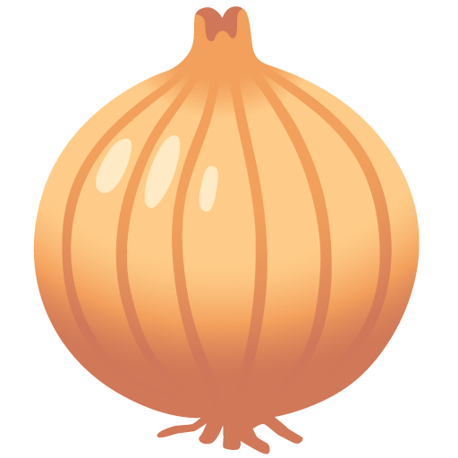
| 
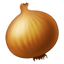
 | 
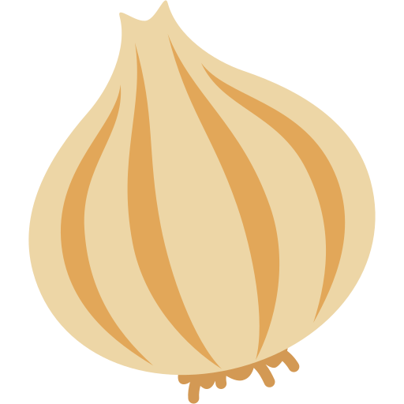
 | 
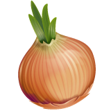
 |
| 🌴   | Arecaceae | 

 | 

 | 

| 

 | 

 | 

 |
| 🥥   | *Cocos nucifera* | 

 | 
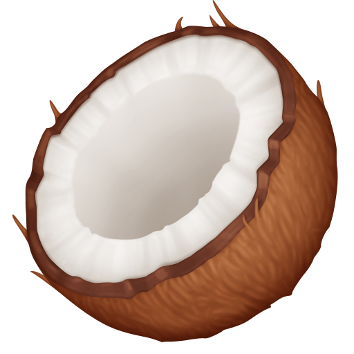
 | 

| 
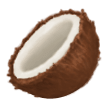
 | 
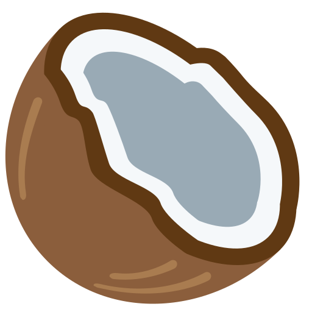
 | 

 |
| 🍌   | *Musa* spp.| 
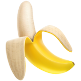
 | 
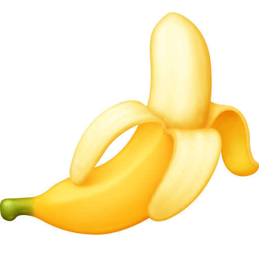
 | 
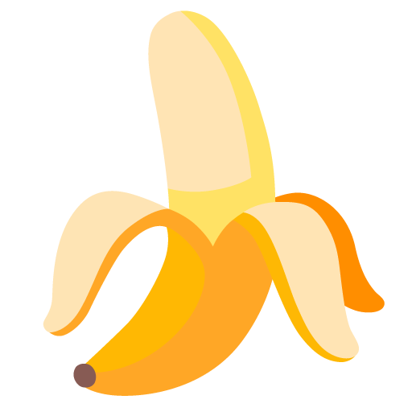
| 

 | 
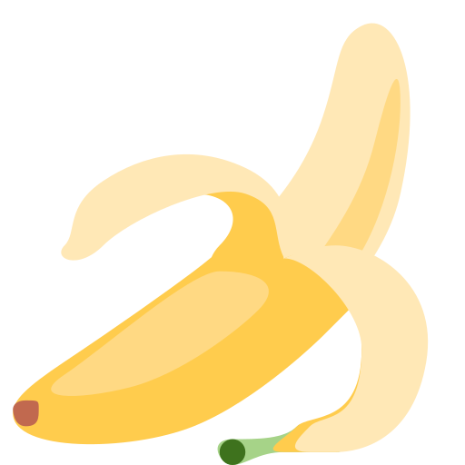
 | 
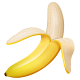
 |
| 🫚   | *Zingiber officinale* | 
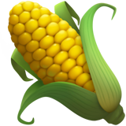
 | 
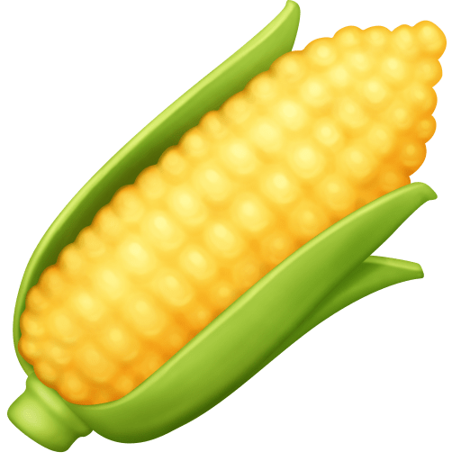
 | 
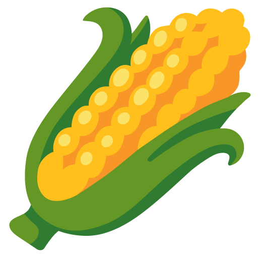
| 
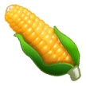
 | 

 | 
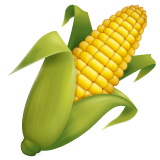
 |
| 🍍   | *Ananas comosus* | 
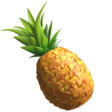
 | 

 | 

| 

 | 

 | 

 |
| 🌽   | *Zea mays* | 

 | 

 | 

| 

 | 

 | 

 |
| 🎋   | Bambusoideae | 

 | 

 | 

| 

 | 

 | 

 |
|  🌾 | *Oryza sativa* | 

 | 

 | 

| 

 | 

 | 

 |
| 🌵   | Cactaceae | 

 | 

 | 

| 

 | 

 | 

 |
| 🍵   | *Camellia sinensis* | 

 | 

 | 

| 

 | 

 | 

 |
| 🥝   | *Actinidia* spp.| 

 | 

 | 

| 

 | 

 | 

 |
| 🫐   | *Vaccinium* spp.| 

 | 

 | 

| 

 | 

 | 

 |
| 🥕   | *Daucus carota* | 

 | 

 | 

| 

 | 

 | 

 |
| 🌻   | *Helianthus annuus* | 

 | 

 | 

 | 

 | 

 | 

 |
| 🌼   | Asteraceae | 

 | 

 | 

 | 

 | 

 | 

 |
| 🫒   | *Olea europaea* | 

 | 

 | 

| 

 | 

 | 

 |
| ☕  | *Coffea* spp. | 

 | 

 | 

| 

 | 

 | 

 |
| 🍠   | *Ipomea patatas* | 

 | 

 | 

| 

 | 

 | 

 |
| 🚬   | *Nicotiana tabacum* | 

 | 

 | 

| 

 | 

 | 

 |
| 🌶️🫑 | *Capsicum* spp. | 

 | 

 | 

| 

 | 

 | 

 |
| 🍆   | *Solanum melongena* | 

 | 

 | 

| 

 | 

 | 

 |
| 🥔   | *Solanum tuberosum* | 

 | 

 | 

| 

 | 

 | 

 |
| 🍅   | *Solanum lycopersicum* | 

 | 

 | 

| 

 | 

 | 

 |
| 🍇   | *Vitis vinifera* | 

 | 

 | 

| 

 | 

 | 

 |
| 🥦   | *Brassica oleracea* | 

 | 

 | 

| 

 | 

 | 

 |
| 🌺   | *Hibiscus* spp.| 

 | 

 | 

| 

 | 

 | 

 |
| 🍫   | *Theobroma cacao* | 

 | 

 | 

| 

 | 

 | 

 |
| 🥭   | *Mangifera indica* | 

 | 

 | 

| 

 | 

 | 

 |
| 🍁   | *Acer* spp. | 

 | 

 | 

| 

 | 

 | 

 |
| 🍊   | *Citrus reticulata* | 

 | 

 | 

| 

 | 

 | 

 |
| 🍋   | *Citrus limon* | 

 | 

 | 

| 

 | 

 | 

 |
| ☘️🍀   | *Trifolium* spp.| 

 | 

 | 

| 

 | 

 | 

 |
| 🥜   | *Arachis hypogaea* | 

 | 

 | 

| 

 | 

 | 

 |
| 🫘   | Fabaceae | 

 | 

 | 

| 

 | 

 | 

 |
| 🫛   | *Pisum sativum* | 

 | 

 | 

| 

 | 

 | 

 |
| 🌰   | *Castanea* spp.| 

 | 

 | 

| 

 | 

 | 

 |
| 🎃   | *Cucurbita pepo* subsp. *pepo*| 

 | 

 | 

| 

 | 

 | 

 |
| 🍉   | *Citrullus lanatus * | 

 | 

 | 

| 

 | 

 | 

 |
| 🥒   | *Cucumis sativus* | 

 | 

 | 

| 

 | 

 | 

 |
| 🍈   | *Cucumis melo* | 

 | 

 | 

| 

 | 

 | 

 |
| 🌹   | *Rosa* spp.| 

 | 

 | 

| 

 | 

 | 

 |
| 🍓   | *Fragaria ×ananassa*| 

 | 

 | 

| 

 | 

 | 

 |
| 🍐   | *Pyrus communis* | 

 | 

 | 

| 

 | 

 | 

 |
| 🍎🍏 | *Malus* spp. | 

 | 

 | 

| 

 | 

 | 

 |
| 🍑   | *Prunus* spp.| 

 | 

 | 

| 

 | 

 | 

 |
| 🌸   | *Prunus* spp.| 

 | 

 | 

| 

 | 

 | 

 |
| 🍒   | *Prunus* subg. *Cerasus* | 

 | 

 | 

| 

 | 

 | 

 |
